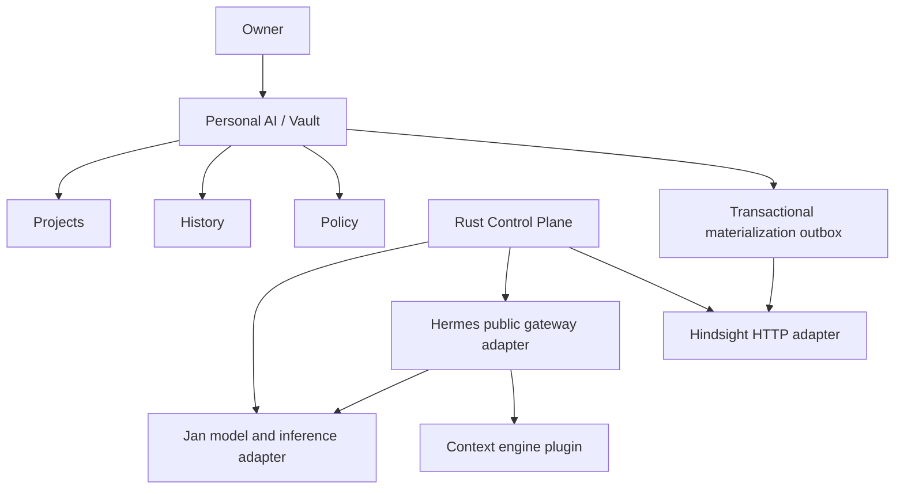

# My AI architecture — M0 candidate

My AI by Freemy composes replaceable local components around owner-controlled AI
state. The Rust Control Plane owns Orchestrator, Vault, Policy, Catalog,
Compatibility, Migration and Health. Jan owns desktop/model UX and its inference
integration. Hermes owns the agent loop; Hindsight owns memory indexing; LCM owns
context compaction and recovery. No UI changes are part of M0.

The diagram shows ownership and dependency, not a literal linear message pipe.
Recall occurs before inference; retention follows the durable turn; LCM observes
history and compacts when needed. M0 must correlate one synthetic conversation
across these surfaces, not merely ping four services.

## Boundaries

- Rust domain types own portable identifiers and errors. Adapters translate wire
  formats and version differences. Frontend types are generated from Rust in M1+.
- Model source resolution returns artifact identity, URLs and secret references.
  Jan download transport supplies transfer/resume/verification.
- Inference exposes OpenAI-compatible local HTTP and health. The current Jan
  worker remains crash-isolated, with a per-run bearer credential and ephemeral port.
- Hermes is a subprocess driven through public JSON-RPC; do not import internals.
- Hindsight runs outside the Hermes virtualenv. LCM is a Hermes user plugin.
- Runtime-derived memories are canonicalized with provenance before being treated
  as owned durable state. Index availability never substitutes for Vault durability.

## Lifecycle

Discover → verify pin → stage → configure isolated profile → start dependencies →
health → capability smoke → ready. Each operation has an idempotency key, deadline,
owned-process handle and persisted outcome. A restart resumes incomplete steps;
it does not rerun side effects blindly. Adopted external runtimes are read-only
dependencies and are never stopped or upgraded implicitly.

No architecture freeze or certified stack until [M0 gates](M0_REPORT.md) pass.
